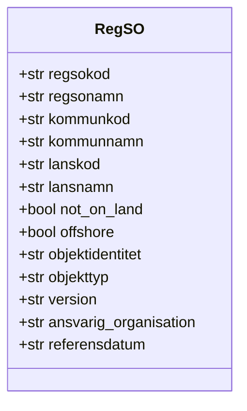

# duva 🕊️
Reverse geocode Swedish coordinates to RegSO areas.

## Install
```bash
pip install duva
```

## Usage
```python
from duva import locate, locate_many, enrich_df, from_code, from_name, search

# Single coordinate (WGS84)
locate(x=17.88, y=59.35)
# {'regsonamn': 'Blackeberg', 'kommunnamn': 'Stockholm', 'lansnamn': 'Stockholms län', ...}

# As object
result = locate(x=17.88, y=59.35, as_object=True)
result.regsonamn  # 'Blackeberg'

# List of coordinates
locate_many([(17.88, 59.35), (18.07, 59.28)])

# Enrich a Polars DataFrame
enrich_df(df, x_col="lon", y_col="lat")

# Lookup by RegSO code
from_code("0180R009")

# Lookup by name (returns list since names are not unique across Sweden)
from_name("Blackeberg")
from_name("Östermalm")  # returns all areas named Östermalm across Sweden

# Search by partial name with optional kommun/län filters
search("östermalm")
search("östermalm", kommunnamn="Borlänge")
search("centrum", lansnamn="Stockholms län")
search("centrum", kommunnamn="Sollentuna", lansnamn="Stockholms län")
```

## RegSO object



`not_on_land` is `True` when the coordinate falls over water. `offshore` is `True` specifically for international water where no municipality boundary exists — a coordinate over a lake will have `not_on_land=True` but `offshore=False` since it still belongs to a municipality.

## Notes
- Input coordinates must be WGS84 (standard GPS)
- Raises `ValueError` for invalid coordinates or coordinates outside Sweden
- Area names are not unique across Sweden — `from_name` and `search` return lists
- Based on SCB's RegSO 2025 and municipality boundaries
